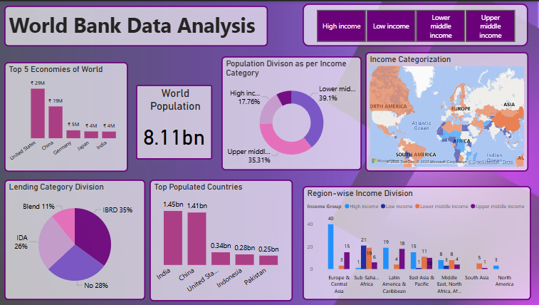

# 🌍 World Bank Data Analysis Dashboard (Power BI)

This repository contains my **fourth Power BI project**, where I analyzed **real-world development data** downloaded from the **World Bank Open Data Catalog**. This project was a highly valuable learning experience that involved working with large, messy datasets, transforming them using Power Query, and building an interactive dashboard that highlights global development insights.

---

## 📁 Datasets Used

All datasets were downloaded from the [World Bank Data Catalog](https://datacatalog.worldbank.org/search/dataset/0037712):

- ✅ **World Development Indicators** dataset  
- ✅ **Global GDP Dataset**  
- ✅ **2024 World Population Dataset**

---

## 🧠 Learning Objectives

- Practice data cleaning and modeling with real-world datasets
- Use Power Query Editor for complex transformations
- Create visual storytelling dashboards using Power BI visuals
- Work with world-level data across multiple indicators

---

## 🛠 Tools & Technologies

- **Power BI Desktop**
- **Power Query Editor**
- **DAX (Data Analysis Expressions)**
- **Custom Theme and Visual Formatting**
- **Map Visualizations**
- **KPI Cards and Slicers**

---

## 📊 Dashboard Description

### 💡 Dashboard Title: **World Bank Data Analysis**

This dashboard consists of **7 key visual sections**:

1. **📈 Top 5 Economies of the World**  
   - *Clustered Bar Chart* showing GDP comparison  
   - Countries: United States, China, Germany, Japan, India

2. **📊 Population Division as per Income Category**  
   - *Donut Chart* displaying income-based population split  
   - Categories: High income, Upper-middle income, Lower-middle income, Low income

3. **🌐 Income Categorization Map**  
   - *Filled Map* showing countries colored by income group  
   - Region-based geographical insights (Africa, Asia, Europe, etc.)
   - To enhance interactivity, I applied a **slicer** to the map visual that allows users to filter countries based on their **income category**.  
This feature makes it easy to explore how different income groups are distributed globally.  
Users can select from categories such as **High income**, **Upper middle income**, **Lower middle income**, and **Low income**.  
The map updates dynamically, helping users visually identify income-based regional patterns across the world.

4. **👥 World Population KPI**  
   - *Card visual* displaying the global population (8.11 billion)

5. **🏦 Lending Category Division**  
   - *Pie Chart* showing the distribution among lending categories (IBRD, IDA, Blend, No)

6. **📊 Top Populated Countries**  
   - *Bar Chart* comparing population of top 5 countries  
   - India, China, United States, Indonesia, Pakistan

7. **🌍 Region-wise Income Division**  
   - *Stacked Column Chart* showing income group split across global regions  
   - Regions: Europe & Central Asia, Sub-Saharan Africa, South Asia, etc.

---

## 🔧 Data Cleaning & Modeling

- Transformed data using **Power Query Editor**
- Removed nulls, reshaped columns, renamed headers
- Joined related tables (e.g., Income Groups, Population Data, Lending Categories)
- Created clean data models for each visual group

---

## 🖼 Dashboard Preview

---

## 🙋‍♀️ About Me

Hi! I’m **Varsha**, a passionate computer science student and aspiring data analyst. This is my **fourth Power BI dashboard**, where I challenged myself to analyze large real-world datasets and present actionable insights in an engaging way.

- 💼 GitHub: [github.com/yourusername](https://github.com/yourusername)
- 🔗 LinkedIn: [linkedin.com/in/yourprofile](https://linkedin.com/in/yourprofile)

---

## 🤝 Contributions

Feel free to use this dashboard as a learning reference or fork the repository. PRs are welcome if you'd like to improve or add more insights!

---

## 📌 Disclaimer

This project is independently created using publicly available World Bank data and is not affiliated with the World Bank Group.

